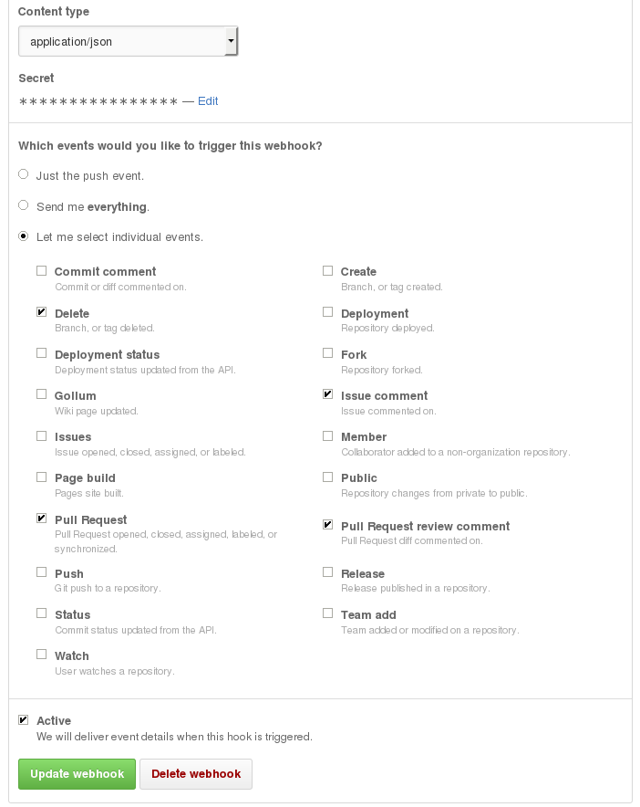

# trello-reviewer

Manage code reviews on GitHub using Trello boards.

Creates a card for every GitHub pull request;
follows the lifecycle of the pull request using the board.

## Quick Start

To see how trello-reviewer works quickly.

Add the default webhook to your GitHub repository.

Choose "Let me select individual events", and tick just the events selected in the image below:

* Delete,
* Pull Request,
* Issue comment,
* and Pull Request review comment.

### Configure

[Create a consumer token](https://trello.com/1/authorize?key=5fb96cf3838f76d61a98e9c74da8ccf6&name=TrelloReviewer&expiration=never&response_type=token&scope=read,write).

### Installation

trello-reviewer should be installed on a public server of your own,
preferably your integration server.
Don't have an integration server?
Well, you really should have one!
Choose a machine with node >= v0.10 installed, and clone it:

    $ git clone https://github.com/alexfernandez/trello-reviewer.git

And move inside the newly created directory:

    $ cd trello-reviewer

You now have to run it:

    $ node bin/reviewServer.js

Without any options it is not going to be much use.

### Credentials File

You will probably find it comfortable to create a file `credentials.json`
in the root of the `trello-reviewer` directory.

## Code Review Process

trello-reviewer is written with a very specific review process in mind.
It is adapted from the [Apache Voting Process](http://www.apache.org/foundation/voting.html#votes-on-code-modification):
at least two devs must approve a pull request, and none should veto it.

##  Managed Service

Is there any managed service for trello-reviewer? Short answer: no.

Long answer: The point of this package is to keep control of your data,
not having to authorize third parties to read your repos or manage your Trello boards.

If you really need to automate the integration between GitHub and Trello,
and do not want to go through the hassle of setup,
just use [Zapier](https://zapier.com/zapbook/github/trello/)
which appears to be a very nice integration service.

